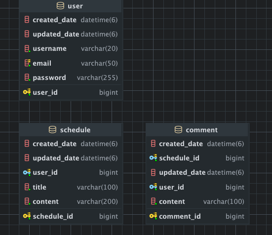

# 일정 관리 애플리케이션 (Schedule Management API)
Spring Boot 기반의 RESTful API 일정 관리 시스템입니다. 일정 CRUD 기능과 댓글 기능을 제공하며, 비밀번호 기반 인증을 통해 일정을 안전하게 관리할 수 있습니다.
## 🎯 주요 기능
### 사용자 관리
- 회원가입, 로그인 (세션 기반)
- 사용자 조회 (전체, 단건)
- 사용자 삭제
- 비밀번호 암호화 (BCrypt)
### 일정 관리
- 일정 생성, 조회, 수정, 삭제 (CRUD)
- 유저 아이디로 일정 검색
- 수정일 기준 내림차순 정렬
- 로그인 세션 기반 수정/삭제 권한 관리
- 페이지네이션 조회
### 댓글 기능
- 일정에 대한 댓글 작성 및 관리
- 일정 조회 시 댓글 목록 포함
- 사용자 권한 검증
- 댓글 개수 제한 (일정당 최대 10개)
### 데이터 검증
- Spring Validation을 통한 입력값 검증
- 전역 예외 처리 (GlobalExceptionHandler)
- 적절한 HTTP 상태 코드 반환
- 일관된 에러 응답 포맷
## 🛠 기술 스택
- Framework: Spring Boot 3.5.7
- Language: Java 17
- Database: MySQL 8.0
- ORM: Spring Data JPA (Hibernate)
- Build Tool: Gradle
- Validation: Spring Validation
- Lombok: 코드 간소화
## 📡 API 명세
- 프로젝트의 HTTP API 설계를 확인하려면 아래 링크를 참조해주세요.
- https://polarized-fireman-344.notion.site/2b1c7a901fb58013a476f2b382fbefcd?v=2b1c7a901fb581489950000c857a3fee&pvs=74
## 📊 ERD


#### 주요 테이블 관계:
- User 1 : N Schedule (사용자 - 일정)
- Schedule 1 : N Comment (일정 - 댓글)
- User 1 : N Comment (사용자 - 댓글)

## 📁 프로젝트 구조
```
src
└── main
    ├── java
    │   └── com
    │       └── example
    │           └── scheduleproject
    │               ├── ScheduleProjectApplication.java
    │               ├── comment
    │               │   ├── controller
    │               │   │   └── CommentController.java
    │               │   ├── dto
    │               │   │   ├── req
    │               │   │   │   ├── CreateCommentRequest.java
    │               │   │   │   └── UpdateCommentRequest.java
    │               │   │   └── res
    │               │   │       ├── CreateCommentResponse.java
    │               │   │       ├── GetCommentResponse.java
    │               │   │       └── UpdateCommentResponse.java
    │               │   ├── entity
    │               │   │   └── Comment.java
    │               │   ├── repository
    │               │   │   └── CommentRepository.java
    │               │   └── service
    │               │       └── CommentService.java
    │               ├── common
    │               │   ├── config
    │               │   │   └── SecurityConfig.java
    │               │   ├── entity
    │               │   │   └── BaseEntity.java
    │               │   └── exception
    │               │       ├── CustomException.java
    │               │       ├── ErrorResponse.java
    │               │       ├── ExceptionMessage.java
    │               │       └── GlobalExceptionHandler.java
    │               ├── schedule
    │               │   ├── controller
    │               │   │   └── ScheduleController.java
    │               │   ├── dto
    │               │   │   ├── req
    │               │   │   │   ├── CreateScheduleRequest.java
    │               │   │   │   ├── DeleteScheduleRequest.java
    │               │   │   │   └── UpdateScheduleRequest.java
    │               │   │   └── res
    │               │   │       ├── CreateScheduleResponse.java
    │               │   │       ├── GetScheduleDetailResponse.java
    │               │   │       ├── GetScheduleResponse.java
    │               │   │       ├── SchedulePageResponse.java
    │               │   │       └── UpdateScheduleResponse.java
    │               │   ├── entity
    │               │   │   └── Schedule.java
    │               │   ├── repository
    │               │   │   └── ScheduleRepository.java
    │               │   └── service
    │               │       └── ScheduleService.java
    │               └── user
    │                   ├── controller
    │                   │   └── UserController.java
    │                   ├── dto
    │                   │   ├── req
    │                   │   │   ├── CreateUserRequest.java
    │                   │   │   ├── DeleteUserRequest.java
    │                   │   │   └── LoginRequest.java
    │                   │   └── res
    │                   │       ├── GetUserResponse.java
    │                   │       └── LoginResponse.java
    │                   ├── entity
    │                   │   └── User.java
    │                   ├── repository
    │                   │   └── UserRepository.java
    │                   └── service
    │                       └── UserService.java
    └── resources
        └── application.properties

```
## 💡 주요 구현 사항
### 1. 3 Layer Architecture
- Controller: HTTP 요청/응답 처리, 입력 검증
- Service: 비즈니스 로직, 트랜잭션 관리
- Repository: 데이터베이스 접근, JPQL 쿼리
각 계층이 명확한 책임을 가지고 있어 유지보수성과 확장성이 높습니다.
### 2. 비밀번호 암호화 (BCrypt)
```Java
@Bean
public PasswordEncoder passwordEncoder() {
    return new BCryptPasswordEncoder();
}

// 사용
String encodedPassword = passwordEncoder.encode(request.getPassword());
```
회원가입 시 비밀번호를 BCrypt로 암호화하여 데이터베이스에 저장하며, 로그인/삭제 시 입력받은 비밀번호와 비교합니다.
### 3. 세션 기반 인증
```Java
@Transactional(readOnly = true)
public LoginResponse login(@Valid LoginRequest request, HttpSession session) {
    User user = userRepository.findByEmail(request.getEmail())
            .orElseThrow(() -> new CustomException(ExceptionMessage.INVALID_LOGIN));

    verifyPassword(request.getPassword(), user.getPassword());

    // 세션 저장
    session.setAttribute("userId", user.getUserId());
    session.setAttribute("email", user.getEmail());

    return new LoginResponse(user.getUserId(), user.getUsername(), user.getEmail());
}
```
로그인 성공 시 userId와 email을 세션에 저장합니다. 이후 API 요청 시 userId를 Query Parameter로 전달받아 권한을 검증합니다.
### 4. 권한 검증 (userId 기반)
```Java
// 수정 시 권한 검증
if (!schedule.getUser().getUserId().equals(userId)) {
        throw new CustomException(ExceptionMessage.SCHEDULE_NO_PERMISSION);
}

// 댓글 삭제 시 권한 검증
        if (!comment.getUser().getUserId().equals(userId)) {
        throw new CustomException(ExceptionMessage.COMMENT_NO_PERMISSION);
}
```
모든 수정/삭제 작업 시 요청한 사용자가 해당 리소스의 소유자인지 검증합니다.
### 5. 입력값 검증
Spring Validation을 사용한 선언적 검증을 구현했습니다.
```Java
@NotBlank(message = "일정 제목은 필수입니다.")
@Size(max = 30, message = "일정 제목은 최대 30자까지 입력 가능합니다.")
private String title;
```
검증 규칙:
- 일정 제목: 최대 30자, 필수, 공백 불가
- 일정 내용: 최대 200자, 필수, 공백 불가
- 댓글 내용: 최대 100자, 필수, 공백 불가
- 사용자명, 이메일, 비밀번호: 필수, 공백 불가
- 이메일: 중복 불가, 유효한 이메일 형식
### 6. 전역 예외 처리
```Java
@RestControllerAdvice
public class GlobalExceptionHandler {
    @ExceptionHandler(MethodArgumentNotValidException.class)
    public ResponseEntity<ErrorResponse> handleValidationException(...) {
        // 400 Bad Request
    }
    
    @ExceptionHandler(CustomException.class)
    public ResponseEntity<ErrorResponse> handleCustomException(...) {
        // 상황에 따라 401, 403, 404, 409 등
    }
}
```
일관된 에러 응답 포맷으로 모든 예외를 처리합니다.
### 6. 페이지네이션
```Java
@Transactional(readOnly = true)
public Page<SchedulePageResponse> getScheduleWithPagination(int page, int size) {
    if (page < 0) page = 0;
    if (size <= 0) size = 10;
    
    Pageable pageable = PageRequest.of(page, size);
    return scheduleRepository.findAllWithCommentCountPaging(pageable);
}
```
일정 목록을 페이지네이션으로 조회하며, 각 일정의 댓글 개수도 함께 반환합니다.
### 7. RESTful API 설계
- 리소스 중심 URL 설계 (/users, /schedules, /comments)
- 적절한 HTTP 메서드 사용 (GET, POST, PATCH, DELETE)
- 명확한 HTTP 상태 코드 반환
- Query Parameter 활용 (페이지네이션, 필터링, 권한 검증)
## 📌 개발 중 해결한 문제
### 1. 단건 조회 시 댓글 별도 쿼리로 조회
- 구현: 일정 단건 조회 시 댓글을 별도의 쿼리로 조회하여 관리
페이지네이션을 사용하는 프로젝트 특성상 Fetch Join을 사용하지 않고, 단건 조회(findScheduleDetail)와 댓글 조회(findCommentsByScheduleIdAsDto)를 분리하여 구현했습니다.
- 이렇게 분리함으로써 필요한 경우에만 댓글을 조회하고, 페이지네이션 시에는 댓글 정보를 포함하지 않아 효율적입니다.
### 2. 권한 검증 로직
문제: 매번 수정/삭제 API에서 비밀번호 검증 로직을 중복으로 작성
해결: Query Parameter userId를 활용하여 세션 기반 권한 검증으로 통일
```Java
if (!schedule.getUser().getUserId().equals(userId)) {
    throw new CustomException(ExceptionMessage.SCHEDULE_NO_PERMISSION);
}
```

